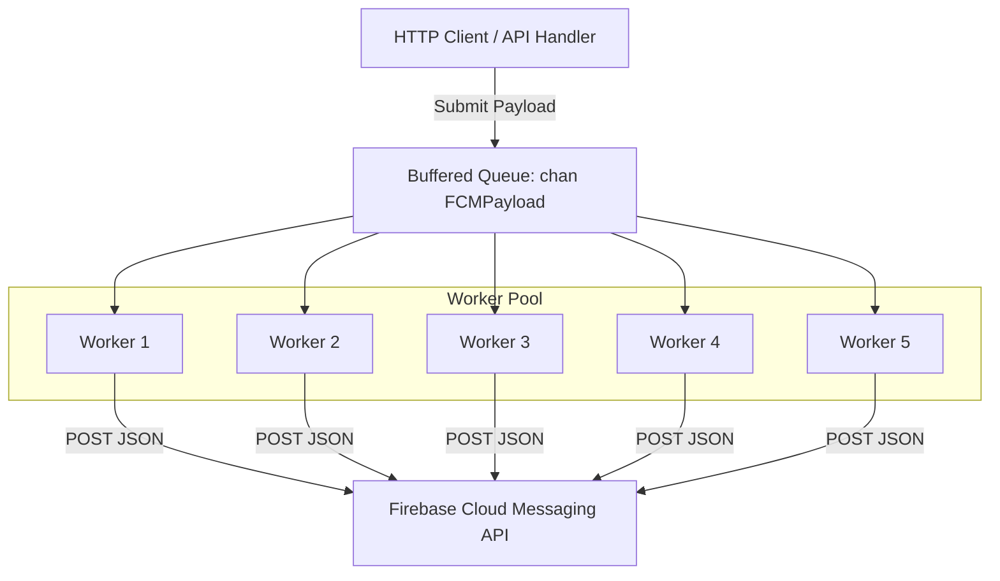
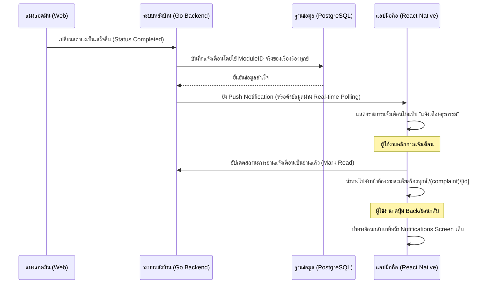
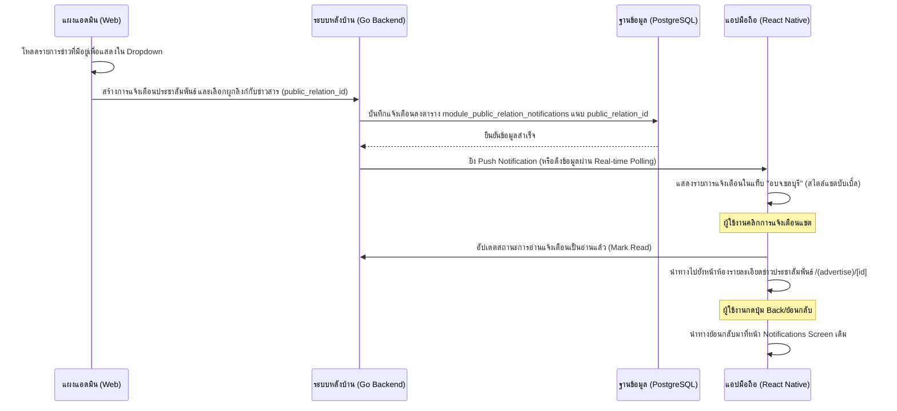

# สถาปัตยกรรมโมดูลการแจ้งเตือน (Notification Module Architecture)

เอกสารฉบับนี้สรุปรายละเอียดและการตัดสินใจเชิงสถาปัตยกรรม (Architectural Decisions) ในการพัฒนาโมดูลการแจ้งเตือนประสิทธิภาพสูงสำหรับ Super App ทั้งในส่วนของ Go Backend, React Native Mobile App และ Next.js Admin Web

---

## 1. การตัดสินใจระดับฐานข้อมูล (Database & GORM Structs)

ตารางฐานข้อมูลและโมเดลทั้งหมดที่สร้างขึ้นใหม่ในระบบจะใช้พรีฟิกซ์ `module_` เสมอ เพื่อความเป็นระเบียบเรียบร้อยและไม่ทับซ้อนกับข้อมูลเดิมในภาพรวม

### 1.1 ตาราง `module_device_tokens`
* **วัตถุประสงค์**: ใช้สำหรับจับคู่ความสัมพันธ์ของอุปกรณ์ของผู้ใช้งานแต่ละราย (`user_id`) กับรหัสรับส่งข้อความแจ้งเตือนจาก Firebase (`token`) 
* **โครงสร้างโมเดล**:
  * ใช้ **UUID v4** เป็นคีย์หลัก (Primary Key) เสมอเพื่อความปลอดภัยทางด้านความลับของไอดีและการแลกเปลี่ยนข้อมูลข้ามแพลตฟอร์ม
  * ทำการสร้าง **Index** บนคอลัมน์ `user_id` เพราะบ่อยครั้งเมื่อเกิดกิจกรรมบางอย่างในแอป ระบบจำเป็นต้องทำการ Query หา Tokens ทั้งหมดของไอดีผู้รับนั้นๆ ทันที
  * มีคอลัมน์ `device_type` ("ios" | "android") ช่วยให้สามารถส่ง Payload ที่ปรับแต่งเฉพาะเจาะจงให้ตรงตามไกด์ไลน์ความปลอดภัยของ OS นั้นๆ ได้อย่างแม่นยำ

### 1.2 ตาราง `module_notifications` (Composite Index)
* **การออกแบบเพื่อขีดสุดประสิทธิภาพ (Ultra-Performance Composite Index)**:
  * ในโมเดล `ModuleNotification` ได้เพิ่มคอลัมน์ตรวจสอบการอ่าน `is_read` (boolean) 
  * ทำการสร้าง Composite Index บน 3 คอลัมน์ร่วมกันดังนี้:
    ```go
    UserID       // ลำดับที่ 1 (priority:1)
    IsRead       // ลำดับที่ 2 (priority:2)
    CreatedDate  // ลำดับที่ 3 (priority:3)
    ```
  * **ทำไมตัวเลือกนี้จึงประหยัดทรัพยากรฐานข้อมูลมหาศาล (The "Why")**: 
    1. ผู้ใช้งานทั่วไปเกือบ 100% มักจะโหลดหน้า Notification เพื่อมองหาแจ้งเตือนที่ "ยังไม่ได้อ่าน" และต้องการดู "ตัวล่าสุดเพิ่งส่งมา"
    2. การคิวรีแบบนี้จะประมวลผลคำสั่ง SQL `SELECT * FROM module_notifications WHERE user_id = '...' AND is_read = false ORDER BY created_date DESC`
    3. ด้วยลำดับ Composite Index ที่ตรงกันเป๊ะ Database Optimizer (Postgres) จะดึงข้อมูลผลลัพธ์ผ่าน **Index Scan** และอ่านข้อมูลตรงเข้า CPU ทันทีโดยไม่ต้องทำการสแกนตารางแบบเต็มสูบ (Full Table Scan) และไม่ต้องพึ่งพา Memory Buffer ในการจัดเรียงวันเวลา (Sorting) ใหม่ ส่งผลให้ประสิทธิภาพรวดเร็วขึ้นเป็นระดับเสี้ยววินาทีแม้ฐานข้อมูลจะมีปริมาณข้อมูลหลักล้านแถว

---

## 2. รูปแบบการจัดคิวส่งแจ้งเตือน (FCM Worker Pool Pattern)

ในการส่งสัญญาณ Push Notification ไปยัง Google Firebase API เพื่อแจ้งเตือนไปยังแอปปลายทาง เราห้ามทำการเปิด Thread (Goroutine) สดๆ โดยไม่ควบคุมขนาดเด็ดขาด



### 2.1 ทำไมต้องใช้ Buffered Channel และ Worker Pool?
* **ลดความเสี่ยง Goroutine Memory Leaks**: เครือข่ายการส่งสัญญาณไปยัง Google API อาจเกิดความล่าช้า (Network Latency) หรือเกิดระบบหยุดทำงานชั่วคราว (Outage) หากใช้แนวทางยิงแบบ Asynchronous สดๆ ระบบจะแห่เปิด Goroutine สะสมหลายหมื่นตัวจนนำไปสู่สถานะหน่วยความจำเต็มระบบ (Out of Memory - OOM) ล่มทั้งเซิร์ฟเวอร์
* **ควบคุม Concurrency แน่นหนา**: 
  * ระบบกำหนดจำนวน Workers คงที่ (เช่น 5 Threads) ดึงงานจาก Buffered Queue (ขนาด 1000 ช่อง) มายิงประมวลผลแบบขนาน (Parallel Processing) ปลอดภัย 100%
  * ในกรณีร้ายแรงที่คิวหลักเต็ม (Queue Overflow) ระบบจะตกไปทำงานแบบ **Fallback Asynchronous Go Routine** ทันที เพื่อไม่ให้ API Thread ของผู้ใช้งานเกิดอาการค้าง (Non-blocking) 
  * รองรับระบบสั่งปิดระบบอย่างมีระเบียบ (**Graceful Shutdown**) ล้างข้อมูลที่ค้างอยู่ในช่องทาง Queue และรอจนกว่างานชุดสุดท้ายจะประมวลผลเสร็จสิ้น ปราศจากข้อมูลสูญหาย

---

## 3. สถาปัตยกรรมฝั่งหน้าบ้าน (Frontend Strategy)

### 3.1 React Native (Mobile Push Registration)
* การดึงสิทธิ์การเข้าถึงอุปกรณ์ (Notification Permission) จะเกิดขึ้นเมื่อล็อกอินสำเร็จเพื่อสุขอนามัยที่ดีของ User Experience (ไม่ขอกวนใจผู้ใช้ตอนเปิดแอปครั้งแรก)
* ดึง FCM Token แล้วยิงส่งไปอัปเกรดในตาราง `module_device_tokens` บนเซิร์ฟเวอร์ทันทีเพื่อความสดใหม่ของพิกัดเครื่องรับ

### 3.2 Next.js Admin (SWR Smart Query)
* บนเว็บคอนโซลแอดมินหรือหน้าโปรไฟล์เว็บของยูสเซอร์ แทนที่จะเปิดการทำงานค้างสัญญาณ WebSocket แบบถาวร (ซึ่งสิ้นเปลืองแบนด์วิดท์เซิร์ฟเวอร์มหาศาล) ระบบเลือกใช้ **SWR Hook** 
* กำหนดค่าการทำงานให้ปิดกั้นการใช้ WebSocket และดึงข้อมูลผ่านการ Polling ทุกๆ 10 วินาที พร้อมเปิดฟีเจอร์ `revalidateOnFocus` เพื่อดึงข้อมูลเฉพาะช่วงเวลาที่แอดมินกำลังใช้งานหน้าจอนั้นๆ อยู่จริง ช่วยเซฟ CPU และ Connection Pool ของฐานข้อมูลได้อย่างชาญฉลาด

---

## 4. ลำดับขั้นตอนการทำงานและการนำทาง (User Flow & Navigation Mechanics)

เพื่อให้ระบบแจ้งเตือนเชื่อมโยงไปหน้าเนื้อหาแต่ละส่วนได้อย่างลื่นไหลและมีประสิทธิภาพสูง ได้มีการวาง User Flow และกระบวนการนำทางดังนี้:

### 4.1 การร้องเรียนร้องทุกข์ (Complaint Flow & Status Redirection)


### 4.2 ข่าวประชาสัมพันธ์ อบจ.ชลบุรี (Public Relations Flow & News Redirection)

