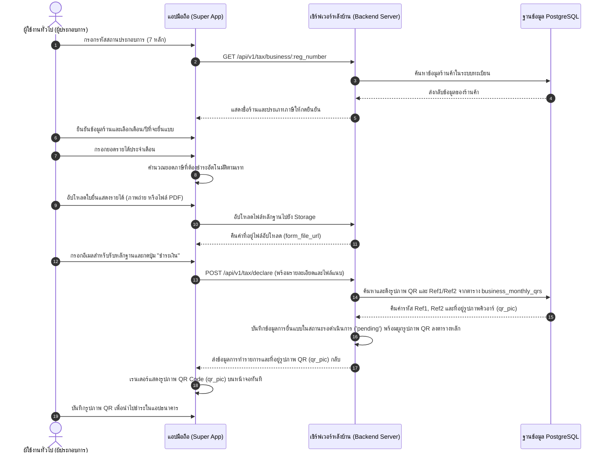

# แผนการออกแบบระบบและขั้นตอนการพัฒนา: โมดูลชำระภาษีและค่าธรรมเนียม (อบจ. ชลบุรี)
## Comprehensive System Design & Implementation Specification - Tax & Fee Module

เอกสารฉบับนี้สรุปรายละเอียดสถาปัตยกรรมทางเทคนิค การออกแบบฐานข้อมูล ตรรกะทางธุรกิจ และโครงสร้างระบบงานทั้งหมดของ **โมดูลการยื่นประเมิน ชำระเงิน และกระทบยอดภาษี/ค่าธรรมเนียม อบจ. ชลบุรี** (ภาษีโรงแรม, ภาษียาสูบ, และภาษีน้ำมัน/แก๊ส) ในรูปแบบ Feature-Driven Clean Architecture

---

## 🗺️ 1. สถาปัตยกรรมของระบบ (System Architecture)

ระบบแบ่งออกเป็น 4 ส่วนหลัก ทำงานร่วมกันอย่างไร้รอยต่อผ่านช่องทาง API ที่มีความปลอดภัย:
1.  **Mobile Client (React Native - Expo)**: แอปพลิเคชันสำหรับประชาชนเพื่อยื่นประเมินภาษี ดูประวัติ และชำระเงินผ่าน QR Code
2.  **Mobile Backend API (Go Fiber)**: เซิร์ฟเวอร์สำหรับแอปมือถือ จัดการยื่นแบบประเมินและจัดทำ Dynamic QR Code
3.  **Admin Portal (Next.js 16 - TailwindCSS)**: แผงควบคุมสำหรับเจ้าหน้าที่และผู้บริหารในการอนุมัติ อัปโหลดรายงาน ดูแดชบอร์ด และพิมพ์ใบเสร็จ A4
4.  **Admin Backend API (Go Fiber)**: เซิร์ฟเวอร์หลักสำหรับเจ้าหน้าที่ จัดการตารางข้อมูล วิเคราะห์ไฟล์รายงานธนาคาร และกระทบยอดภาษี

```
 ┌───────────────────────┐                 ┌───────────────────────────┐
 │ Chonburi Plus Mobile  │                 │    Admin Portal Web       │
 │   (React Native/App)  │                 │    (Next.js 16/Admin)     │
 └──────────┬────────────┘                 └─────────────┬─────────────┘
            │                                            │
    HTTPS   ▼ (Public Port: 8081)                HTTPS   ▼ (Protected Port: 8080)
 ┌───────────────────────┐                 ┌───────────────────────────┐
 │   Mobile Go API       │◄───(Same DB)───►│       Admin Go API        │
 │ (Self-Decl/QR Gen/Pay)│                 │ (Reconciliation/Auditors) │
 └──────────┬────────────┘                 └─────────────┬─────────────┘
            │                                            │
            └───────────────┬────────────────────────────┘
                            ▼
                  ┌───────────────────┐
                  │ PostgreSQL GORM   │
                  │  (Core Database)  │
                  └───────────────────┘
```

---

## 💾 2. การออกแบบโครงสร้างฐานข้อมูล (Database Schema Design)

ระบบงานถูกขับเคลื่อนผ่านตารางข้อมูลเชิงสัมพันธ์ 6 ตารางหลักบน PostgreSQL โดยมีการทำดัชนี (Indexes) และ Constraints ครบถ้วน เพื่อประสิทธิภาพในการสืบค้น:


### Go GORM Struct Specifications ([internal/domain/tax-new.go](file:///c:/Users/phnjk/super-app-chonburi-go/internal/domain/tax-new.go))
```go
type TaxRate struct {
	ID        uuid.UUID `gorm:"type:uuid;primary_key;default:gen_random_uuid()" json:"id"`
	TaxType   string    `gorm:"type:varchar(30);not null;uniqueIndex;column:tax_type" json:"tax_type"` // 'hotel_fee', 'tobacco_tax', 'oil_gas_tax'
	RateValue float64   `gorm:"type:decimal(10,4);not null;column:rate_value" json:"rate_value"`
	RateUnit  string    `gorm:"type:varchar(20);not null;column:rate_unit" json:"rate_unit"`   // 'percentage', 'per_litre'
	CreatedAt time.Time `gorm:"type:timestamptz;not null;default:now()" json:"created_at"`
	UpdatedAt time.Time `gorm:"type:timestamptz;not null;default:now()" json:"updated_at"`
}

type TaxBusiness struct {
	ID        uuid.UUID `gorm:"type:uuid;primary_key;default:gen_random_uuid()" json:"id"`
	RegNumber string    `gorm:"type:varchar(50);not null;uniqueIndex;column:reg_number" json:"reg_number"`
	NameTH    string    `gorm:"type:varchar(255);not null;column:name_th" json:"name_th"`
	OwnerName *string   `gorm:"type:varchar(255);column:owner_name" json:"owner_name"`
	Email     string    `gorm:"type:varchar(100);not null;column:email" json:"email"`
	CreatedAt time.Time `gorm:"type:timestamptz;not null;default:now()" json:"created_at"`
	UpdatedAt time.Time `gorm:"type:timestamptz;not null;default:now()" json:"updated_at"`
}

type TaxDeclaration struct {
	ID                 uuid.UUID    `gorm:"type:uuid;primary_key;default:gen_random_uuid()" json:"id"`
	BusinessRegNumber  string       `gorm:"type:varchar(50);not null;index;column:business_reg_number" json:"business_reg_number"`
	TaxType            string       `gorm:"type:varchar(30);not null;index;column:tax_type" json:"tax_type"`
	TaxMonth           int          `gorm:"type:integer;not null;column:tax_month" json:"tax_month"`
	TaxYear            int          `gorm:"type:integer;not null;column:tax_year" json:"tax_year"`
	DeclarationVersion int          `gorm:"type:integer;not null;default:1;column:declaration_version" json:"declaration_version"`
	MonthlyRevenue     float64      `gorm:"type:decimal(15,2);not null;column:monthly_revenue" json:"monthly_revenue"`
	CalculatedTax      float64      `gorm:"type:decimal(15,2);not null;column:calculated_tax" json:"calculated_tax"`
	FormFileURL        string       `gorm:"type:text;not null;column:form_file_url" json:"form_file_url"`
	PayerEmail         string       `gorm:"type:varchar(100);not null;column:payer_email" json:"payer_email"`
	Ref1               string       `gorm:"type:varchar(50);not null;uniqueIndex;column:ref1" json:"ref1"`
	Ref2               string       `gorm:"type:varchar(50);not null;index;column:ref2" json:"ref2"`
	PaymentStatus      string       `gorm:"type:varchar(30);not null;default:'pending';index;column:payment_status" json:"payment_status"` // 'pending', 'paid', 'verified', 'audit_failed'
	PaidAmount         *float64     `gorm:"type:decimal(15,2);column:paid_amount" json:"paid_amount"`
	PaidAt             *time.Time   `gorm:"type:timestamptz;column:paid_at" json:"paid_at"`
	AuditedBy          *uuid.UUID   `gorm:"type:uuid;column:audited_by" json:"audited_by"`
	AuditNotes         *string      `gorm:"type:text;column:audit_notes" json:"audit_notes"`
	CreatedAt          time.Time    `gorm:"type:timestamptz;not null;default:now()" json:"created_at"`
	UpdatedAt          time.Time    `gorm:"type:timestamptz;not null;default:now()" json:"updated_at"`
	Business           *TaxBusiness `gorm:"foreignKey:BusinessRegNumber;references:RegNumber" json:"business,omitempty"`
}
```

---

## 📱 3. โมเดลการชำระภาษีในฝั่งโมบายล์แอป (Mobile App Flows & QR PromptPay)

### แผนผังลำดับขั้นตอนการยื่นประเมินและสแกนชำระเงิน (Declaration & Payment Sequence Diagram)
ระบบทำงานในส่วนของโมบายล์แอปพลิเคชันเพื่อช่วยให้ผู้ประกอบการดำเนินการยื่นรายรับและชำระเงินผ่านระบบคิวอาร์เกตเวย์ได้อย่างสะดวกรวดเร็ว:



### A. ตรรกะการคํานวณค่าภาษีที่ถูกต้อง (Tax Calculation Logic)
เมื่อผู้เสียภาษีกรอกยอดรายรับในแอปพลิเคชันมือถือ ระบบจะดึงข้อมูลอัตราภาษีจากตาราง `tax_rates` แล้วประเมินผลยอดชำระจริงทันที เพื่อความแม่นยำในการคำนวณแบบจำกัดเรทเปอร์เซ็นต์จริง:
```go
// การตรวจสอบ Rate Unit ป้องกันบั๊กคูณทศนิยมผิดพลาด
var calculatedTax float64
if rate.RateUnit == "percentage" {
    calculatedTax = req.MonthlyRevenue * (rate.RateValue / 100.0)
} else {
    calculatedTax = req.MonthlyRevenue * rate.RateValue
}
```

### B. รูปแบบสถาปัตยกรรมคิวอาร์แบบดึงข้อมูลล่วงหน้า (Pre-generated QR Gateway Architecture)

เนื่องจากการตกลงปรับเปลี่ยนทิศทางระบบชำระเงินโดยไม่ใช้วิธีคำนวณและเจนคิวอาร์โค้ดสดผ่านระบบหลักแบบไดนามิก ระบบจะเปลี่ยนบทบาทไปทำหน้าที่เสมือน **Gateway** ที่ทำหน้าที่ดึงข้อมูลอ้างอิงและรูปภาพ QR Code สแกนจ่ายของแต่ละรอบบัญชีที่ถูกเตรียมไว้ล่วงหน้าจากอีกแอปพลิเคชันหนึ่งมาแสดงผลให้กับผู้ใช้โดยตรง:

#### 1. การออกแบบตารางจัดเก็บข้อมูลคิวอาร์ล่วงหน้า (`business_monthly_qrs`)
ระบบจะสร้างตารางใหม่เพื่อทำหน้าที่เป็นแหล่งข้อมูลอ้างอิงและที่เก็บรูปภาพ QR Code แยกตามรายร้านค้าและรอบเวลาชำระเงิน:
```go
type BusinessMonthlyQR struct {
    ID                uuid.UUID    `gorm:"type:uuid;primaryKey;column:id;default:uuid_generate_v4()" json:"id"`
    BusinessID        uuid.UUID    `gorm:"type:uuid;not null;column:business_id" json:"business_id"`
    BusinessRegNumber string       `gorm:"type:varchar(20);not null;index;column:business_reg_number" json:"business_reg_number"`
    TaxType           string       `gorm:"type:varchar(50);not null;column:tax_type" json:"tax_type"` // 'hotel_fee', 'oil_gas_tax', 'tobacco_tax'
    TaxMonth          int          `gorm:"type:integer;not null;column:tax_month" json:"tax_month"`
    TaxYear           int          `gorm:"type:integer;not null;column:tax_year" json:"tax_year"`
    Ref1              string       `gorm:"type:varchar(20);not null;index;column:ref1" json:"ref1"`
    Ref2              string       `gorm:"type:varchar(20);not null;index;column:ref2" json:"ref2"`
    QRPic             string       `gorm:"type:varchar(512);not null;column:qr_pic" json:"qr_pic"` // ลิงก์รูปภาพ QR เช่น http://...png
    Amount            *float64     `gorm:"type:numeric(12,2);column:amount" json:"amount,omitempty"`
    IsUsed            bool         `gorm:"type:boolean;not null;default:false;column:is_used" json:"is_used"`
    CreatedAt         time.Time    `gorm:"type:timestamptz;not null;default:now();column:created_at" json:"created_at"`
    UpdatedAt         time.Time    `gorm:"type:timestamptz;not null;default:now();column:updated_at" json:"updated_at"`
}
```

#### 2. กลยุทธ์การนำเข้าข้อมูลคิวอาร์ (One-time Bulk Import Strategy)
* **การนำเข้าข้อมูล**: ข้อมูลชุดภาพ QR รายปี/รายเดือนจะถูกนำเข้าระบบโดยใช้กลยุทธ์ **"นำเข้าครั้งเดียวรอบเดียวจบ (Bulk Seeding/Direct SQL Import)"** ผ่านสคริปต์หลังบ้านหรือการยัดฐานข้อมูลจากระบบฝั่งผู้จัดสรรข้อมูลโดยตรง
* **ข้อจำกัดการพัฒนา**: **ไม่มีการสร้างหน้าจอ UI (หน้าแอดมิน) หรือพอร์ทัลจัดหาอัปโหลดสำหรับระบบนำเข้าเพิ่มเติมภายหลัง** เพื่อความกะทัดรัดและปลอดภัยของข้อมูล ป้องกันการเพิ่มข้อมูลผิดพลาดโดยผู้ควบคุมระบบ

#### 3. ตรรกะกระบวนการผูกข้อมูลธุรกรรม (`DeclareTax` Workflow)
เมื่อผู้เสียภาษีกดทำรายการส่งใบประเมินภาษีผ่านแอปมือถือ:
1. ค้นหาแถวในตาราง `business_monthly_qrs` ที่มีค่า `BusinessRegNumber`, `TaxType`, `TaxMonth`, และ `TaxYear` ตรงกับการประเมิน
2. คัดสำเนาค่า `Ref1`, `Ref2` และค่าลิงก์รูปภาพ `QRPic` จากตารางย่อยลงไปบันทึกไว้ในตารางประวัติธุรกรรม `tax_declarations` (โดยบันทึกเก็บลิงก์รูปภาพไว้ในฟิลด์ `qr_code_content` ของใบประเมินตัวนั้น เพื่อให้ผู้ใช้เปิดประวัติดูภาพเดิมหรือสแกนจ่ายเงินซ้ำได้ย้อนหลังตลอดเวลา)
3. เปลี่ยนสถานะแถวในตารางคิวอาร์ล่วงหน้าเป็น `is_used = true`
4. หากค้นหาไม่พบข้อมูลแถวในตาราง `business_monthly_qrs` ระบบจะตอบกลับข้อผิดพลาดป้องกันการยื่นชำระเงินทันทีเพื่อความปลอดภัยคลังข้อมูล (เช่น *"ยังไม่เปิดให้ยื่นรายการภาษีรอบเดือนนี้ กรุณาติดต่อกองคลัง อบจ."*)

---

## 📑 4. โมดูลกระทบยอดอัตโนมัติ (Automated Reconciliation Engine)

สำหรับธุรกรรมการโอนเงินออนไลน์ ระบบหลังบ้านจะมี Reconciliation Engine ทำงานเมื่อเจ้าหน้าที่นำเข้าข้อมูลสรุปจากธนาคาร:

### A. ตัววิเคราะห์ข้อมูล KTB Bank Reconciliation Parser (120-byte Fixed Width)
รายงานการชำระเงินของธนาคารกรุงไทยจะบันทึกมาในรูปแบบไฟล์ข้อความความกว้างแถวคงที่ขนาด 120-byte โดยระบบจัดทำตัวแยกแยะแถวข้อมูลประสิทธิภาพสูง:
*   **Header Record (Type 01)**: ระบุเลขประจำตัวผู้รับบริการ บัญชีธนาคาร อบจ. และวันที่สร้างไฟล์
*   **Detail Record (Type 02)**: ประกอบไปด้วย
    *   **Ref1** (ตำแหน่ง 52 ถึง 71): เลขประจำตัวผู้ประเมินภาษี
    *   **Ref2** (ตำแหน่ง 72 ถึง 91): รหัสใบรับรายการ
    *   **Amount** (ตำแหน่ง 97 ถึง 109): ยอดเงินที่จ่ายจริง หารด้วย 100 เพื่อแปลงเป็นทศนิยม
    *   **Bank Ref ID** (ตำแหน่ง 110 ถึง 120): หมายเลขยืนยันธุรกรรมธนาคาร
*   **Trailer Record (Type 03)**: สรุปยอดรวมจำนวนแถวและจำนวนเงินทั้งหมดภายในก้อนไฟล์

```go
// ตรรกะแยกแกะข้อมูลรายแถว KTB Detail Record ใน Go
ref1 := strings.TrimSpace(line[51:71])
ref2 := strings.TrimSpace(line[71:91])
amountRaw := strings.TrimSpace(line[96:109]) // e.g. "0000256077546"
amountVal, _ := strconv.ParseFloat(amountRaw, 64)
amount := amountVal / 100.0 // 2,560,775.46 บาท
```

### B. อัลกอริทึมการ Reconcile จับคู่ข้อมูลภาษี
เครื่องมือกระทบยอดจะทำการคัดกรองข้อมูลธุรกรรมธนาคารแล้วนำไปเปรียบเทียบในฐานข้อมูล อบจ.:
1.  ค้นหาใบยื่นแบบประเมินภาษี `tax_declarations` ที่มีค่า `Ref1` และ `Ref2` ตรงกันในฐานข้อมูล
2.  ตรวจสอบยอดเงินว่าตรงกันอย่างสมบูรณ์แบบ (`calculated_tax == amount`)
3.  หากจับคู่ถูกต้อง:
    *   อัปเดตสถานะธุรกรรมในระบบเป็น **`paid` (ชำระเงินแล้ว)**
    *   บันทึกเวลาชำระจริง (`PaidAt`) และยอดเงินที่รับ (`PaidAmount`)
    *   เรียกชุดบริการแจ้งเตือนส่งเมลแนบ PDF หลักฐานให้ประชาชนโดยอัตโนมัติ

---

## 🏛️ 5. [REMOVED] ระบบการชำระเงินหน้าเคาน์เตอร์ (Walk-in Treasury Audit Flow - ยกเลิกการใช้งาน)

> [!NOTE]
> **ข้อตกลงและปรับปรุงข้อกำหนดใหม่**: ในเวอร์ชันการพัฒนานี้ จะ**ไม่มีกรณีการเดินทางมาติดต่อเพื่อชำระเงินหน้าเคาน์เตอร์ (No Walk-in Payments)** อีกต่อไป โดยที่ระบบแอปพลิเคชันนี้จะทำหน้าที่เป็น **Online Gateway แบบ 100% เท่านั้น**
>
> 1. **การปรับสถานะธุรกรรม**: สถานะชำระเงินจะเปลี่ยนจาก `pending` เป็น `paid` (ชำระเงินแล้ว) โดยอัตโนมัติผ่านทางโมดูลกระทบยอดธนาคาร (Automated Reconciliation Engine) จากไฟล์ KTB เท่านั้น
> 2. **สถานะชำระเงินที่ลดทอนออก**: ยกเลิกสถานะ `verified` (ตรวจสอบผ่านแล้ว) และยกเลิกการออกแบบปุ่มอนุมัติแมนนวลด้วยเงินสด/เช็ค เพื่อรักษาทิศทางการทำงานของระบบหลังบ้านให้มีความเป็นเกตเวย์แบบอัตโนมัติโดยสมบูรณ์

---

## 🖨️ 6. โมดูลสร้างใบเสร็จรับเงิน A4 PDF อิเล็กทรอนิกส์

เอนจิ้นสร้างใบเสร็จรับเงินขนาด A4 ถูกสร้างขึ้นเพื่อรักษาความสวยงามและอัตราส่วนที่ถูกต้องตามต้นฉบับทางราชการ:

### A. สถาปัตยกรรมฟอนต์สาราบรรณเพื่อแก้สระซ้อนและไม้เอกหาย (TH Sarabun New Webfont)
*   **สาเหตุปัญหา**: ฟอนต์ภาษาไทยมาตรฐานในระบบคอมไพล์ PDF ทั่วไป จะเกิดปัญหาสระและวรรณยุกต์ (ไม้เอก `่`) ซ้อนเหลื่อมกันจนมองไม่เห็นตัวอักษรไม้เอก (กลายเป็น `วันที` และ `เลขที`)
*   **การแก้ไข**: บูรณาการฟอนต์รุ่นพิเศษ **TH Sarabun New Webfont** ที่จัดสรรช่องไฟสำหรับสระบนโดยเฉพาะเข้ามาเก็บไว้ใน [assets/fonts/](file:///c:/Users/phnjk/super-app-chonburi-go/assets/fonts/) โดยมีฟังก์ชันจดทะเบียนใช้งาน:
```go
pdf.AddUTF8Font("Sarabun", "", fmt.Sprintf("%s/thsarabunnew.ttf", fontDir))
pdf.AddUTF8Font("Sarabun", "B", fmt.Sprintf("%s/thsarabunnewbd.ttf", fontDir))
```

### B. พิกัดและการกำหนดระยะห่างสไตล์เอกสารเป็นทางการ (A4 Spacing Layout Rules)
*   **หัวข้อเอกสาร (Title)**: ใช้ตัวหนา `"Sarabun", "B", 16` วาดตรงกลางกึ่งกลางหน้ากระดาษ
*   **ชื่อ อบจ. ชลบุรี**: ใช้ตัวหนา `"Sarabun", "B", 11` อยู่ถัดลงมา 18 มม. เพื่อความโอ่โถงสวยงาม
*   **ระยะการยื่นชำระเงิน**: หัวข้อ `ได้รับเงินจาก` และชื่อสถานประกอบการ ใช้ฟอนต์ขนาด `10pt` เพื่อความสมส่วนและเพิ่มพื้นที่รองรับตัวอักษรชื่อบริษัทที่ยาวโดยไม่ต้องตัดคำให้เสียความหมาย
*   **พิกัดการแยกบรรทัดรายละเอียดเช็ค**:
    *   หากตรวจพบเช็คธนาคาร ระบบแยกบรรทัดแสดงผลออกเป็น 2 ส่วนด้านในกล่องชำระเงิน
    *   ชื่อธนาคารและสาขาของเช็คจัดวางขนานตรงแนวกับยอดเงินชำระฝั่งขวาพอดีที่พิกัด Y = `boxTop+10`
    *   เลขที่เช็คและวันที่จัดวางลงมาบรรทัดล่างพิกัด Y = `boxTop+16`
    *   บรรทัดสรุปยอดสุทธิแสดงพิกัดด้านล่างที่ Y = `boxTop+22`

---

## 📧 7. โมดูลอีเมลแจ้งหนี้และใบเสร็จอัตโนมัติ (SMTP e-Receipt Mailer)

เมื่อธุรกรรมได้รับการยืนยันการรับยอด (`paid` หรือ `verified`) ระบบ SMTP หลังบ้านจะเริ่มกระบวนการจัดส่ง:
1.  **ดึงข้อมูลที่อยู่อีเมล**: ระบบดึงฟิลด์ `PayerEmail` ของร้านค้าผู้เสียภาษี
2.  **เขียนข้อมูลอีเมล (HTML template)**: สร้างข้อความจดหมายอย่างเป็นทางการ ระบุชื่อร้าน ประเภทภาษี ประจำปีภาษี และยอดเงินจริงที่ได้รับชำระ
3.  **จัดแนบเอกสาร (Attachment)**: เรียกเอนจิ้นสร้างใบเสร็จรับเงิน PDF แปลงไฟล์ข้อมูลเป็น Stream ไบต์ เพื่อเพิ่มแนบเข้าในอีเมลโดยตรงโดยไม่ต้องบันทึกเป็นไฟล์ตกค้างในระบบคอมพิวเตอร์
4.  **จัดส่งไร้รอยต่อ (SMTP Engine)**: สั่งงานฟังก์ชัน `mailClient.Send` เพื่อยื่นส่งหลักฐานเข้าตู้จดหมายประชาชนทันทีอย่างแม่นยำ

---

## 💻 8. ส่วนติดต่อเว็บแอดมิน Next.js 16 (Admin UI Architecture)

หน้าบริหารจัดการหลักของเจ้าหน้าที่อยู่บนระบบโครงร่าง Next.js 16 ( Tailwind CSS ):
*   **พิกัดหน้าหลัก**: `/taxs` (รวบรวมแบบประเมินภาษีทั้งหมด)
*   **พิกัดอัปเดตไฟล์รายงาน**: `/taxs/elaas` (หน้าต่างวางลาก Drag-and-drop ไฟล์ข้อมูล KTB และ e-LAAS CSV)

### A. การเชื่อมต่อหน้าจอ TaxTable Component ([src/presentation/components/features/taxs/tax-table.tsx](file:///c:/Users/phnjk/super-app-chonburi/src/presentation/components/features/taxs/tax-table.tsx))
*   **ปุ่มดาวน์โหลดใบเสร็จสีเขียว**: แสดงผลเฉพาะแถวของสถานะ `paid` หรือ `verified` เท่านั้น
*   **กล่องรายละเอียดการประเมิน (Audit Modal)**:
    *   แสดงภาพเอกสารอ้างอิงและประวัติภาษี
    *   ปุ่ม **"อนุมัติชำระเงิน (Walk-in)"**: สำหรับเจ้าหน้าที่เพื่อเปลี่ยนสถานะแบบแมนนวล พร้อมแสดงฟอร์มเก็บข้อมูลเลขที่เช็คและเงินสด

### B. โค้ดส่งออกหลักฐานใบเสร็จ PDF แบบแอดมิน (Blob Stream Saver)
การเชื่อมข้อมูลฝั่งเบราว์เซอร์แอดมินจะเรียกใช้ API ด้วยค่าตอบรับแบบ `Blob` เพื่อความปลอดภัยและสามารถดาวน์โหลดเอกสาร PDF ทันทีโดยไม่ต้องเปิดแท็บใหม่:
```typescript
const response = await axiosClient.get(`/admin/tax-new/declare/${id}/receipt/pdf`, {
  responseType: 'blob'
});
const blob = new Blob([response.data], { type: 'application/pdf' });
const link = document.createElement('a');
link.href = window.URL.createObjectURL(blob);
link.download = `receipt-${ref1}.pdf`;
link.click();
```

---

## 🧪 9. แนวทางการทดสอบและความถูกต้องหลังพัฒนา (UAT Verification)

*   **Go Backend Unit Tests**:
    ```powershell
    go test ./pkg/pdf -v
    ```
    *(ตรวจสอบว่าคำสั่งเสร็จสิ้นด้วยคำว่า **PASS** และสร้างไฟล์เอกสาร PDF 3 ประเภทภาษีในโฟลเดอร์ `scratch` ครบถ้วน)*
*   **TypeScript / Component Health Checks**:
    ```bash
    npx tsc --noEmit
    ```
    *(ตรวจสอบว่าตัวโครงสร้างสแกนหน้าเว็บ Next.js 16 คอมไพล์ได้สมบูรณ์โดยไม่มีการแจ้งเตือน type mismatch)*
